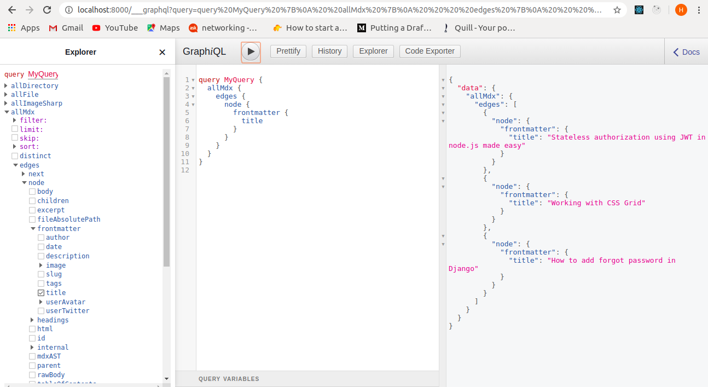

> “Gatsby is a free and open source framework based on React that helps developers   build
  blazing fast website and apps.”
>
That’s their tagline and it’s true to a large extent.
Basically Gatsby is a static site generator. It is built on top of React,webpack and Graphql.

## What does Gatsby do ?
So let’s discuss the power of Gatsby.You just code your website using the modern web technologies like React,modern javascript etc which will provide a great experience to customers.
Now gatsby will transform your code into a directory with a single HTML file and static assets.

## But why choose gatsby to build a static website?

 
 1. You can use the hottest web technology i.e. **React** to build your website.(sorry vue people)
 2. Gatsby webapp is by default a **PWA**. (Progressive Web App)
 3. Gatsby websites are extremely **fast** which is one of the most crucial  aspects of a website. Basically gatsby  pre-build pages and lift them into a global cloud of servers — ready to be delivered instantly to your users wherever they are
 4. Because of **Graphql** you can pull your data in pages from anywhere.By anywhere i mean APIs,SaaS services,Headless CMSs,your filesystem etc.

## Now coming to plugins
 Gatsby plugins are open source anc very easy to use and literally there is a plugin for everything.
 Need a sitemap
 Need wordpress integration
 Need offline support
 Need Sass support
 Need SEO
 Need responsive images etc
 There are currently **2156** plugins in gatsby library.Yeah you  read it right 2156 plugins.
 
## Security and Deployment

Your website is converted into html file and static assets so there is no connection with the database involved. So yes you are safe.

Deployment is **super easy**.If you deploy your website on Netlify it just takes two clicks.That’s it.If your code is fundamentally right.

## Community Support
Gatsbyjs was launched in 2017. It is fairly new but it has a large community.
Even docs of plugins are concisely documented.
Gatsby docs are the best i have ever seen.Even if you are a beginner you will understand it.
Starter kits and themes are game changers. They will be very helpful after some expreience with gatsby.(By experience i meant 2-3 days)
Community is highly active ,all questions are answered by members of the community.

## How long will it take to learn Gatsby and what are its prerequisites?

For prerequisites you should have a good understanding of React.Other then that it will only take **3-4 hours** to build a production ready website using Gatsby.
It will take around 2-3 hours to understand the ecosystem of gatsby.
Now coming to **Graphql**.Gatsby provides a **playground tool** for graphql.Using that you have to only select the data and query will be automatically generated.

Thank you

