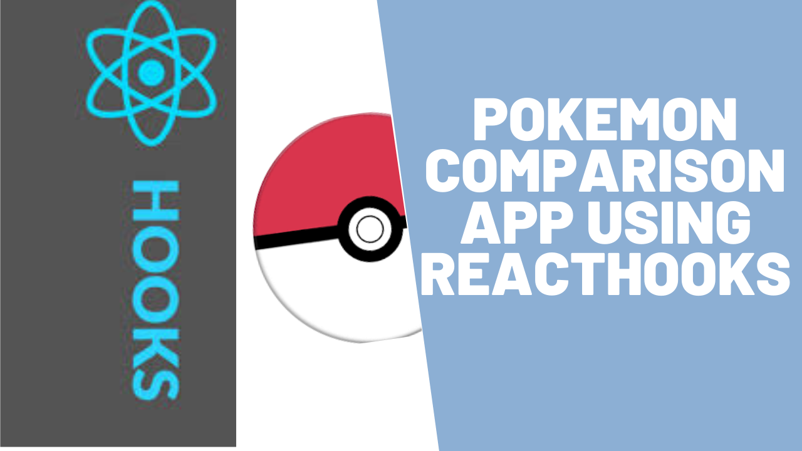

## 


Hello mate,today we will make something fun using react  hooks.For beginners react hooks can be problematic and i think this tutorial will clear some of the concepts .So in this  tutorial we will make a pokemon comparison webapp and for pokemon data we will be using pokeapi which is open source and needs no credentials.

This tutorial is regularly updated so don’t worry, code along with me, it will definitely work.If you get stuck  you can contact me and  below is the link of the github repository.

https://github.com/open-mindd/poke-comporator

#### This is how our end product will look


In this tutorial i will be using only useState and useEffect hook .So yes it will be pretty basic.

 package.json,so you would know about all the dependencies.


So there will be three main components in this app

1. App.js :First app component will fetch all pokemon name from the api and will send it down as props to search component.Then search component will send back names of the selected pokemon.Then we will fetch individual pokemon details from the api and sends it down to preview component as props.

2. Search.js: Search component will have a select-search-dropdown,where users will select the pokemon name.

3. Preview.js: After getting pokemon data from the app component ,the preview component will show the data in a presentable manner.

**Note:- Download the css files from github repository.This tutorial will not cover css.**
 
First start by writing the command

```js
yarn create react-app poke-comparator
```
Now your project  structure should be same as shown in the picture below
So this is our index.js and project structure.


install the required packages from this command
```js
yarn add axios uuid react-select-search --save
```

**App.js**
```js
import React, { useEffect, useState } from "react";
import axios from "axios";
import "./App.css";
import Search from "./Search";

function App() {
  const [pokemons, setPokemons] = useState([]);
  const [name1, setPokname1] = useState("");
  const [name2, setPokname2] = useState("");
  useEffect(() => {
    let list = [];
    axios
      .get(`https://pokeapi.co/api/v2/pokemon?limit=964`)
      .then((pokemons) => {
        console.log(pokemons.data);

        list = pokemons.data.results;
        setPokemons(list);
      })
      .catch((err) => console.log(err));
  }, []);

  function onChange1(name) {
    setPokname1(name);
  }
  function onChange2(name) {
    setPokname2(name);
  }
  function onSubmit(e) {
    e.preventDefault();
  }

  return (
    <div className="App">
      <h1>Poke Comparator</h1>
      <Search
        onChange1={onChange1}
        onChange2={onChange2}
        onSubmit={onSubmit}
        options={pokemons.map((pokemon) => ({
          value: pokemon.name,
          name: pokemon.name,
        }))}
      />
    </div>
  );
}
export default App;
```

We have one state i.e. pokemons.Here  useEffect will only work once after first render,because we have passed empty array as dependency.The api is sending us all the 964 pokemon name array which we are sending down as props to Search compoment.Here options array is mapped as key value pair  because react-select-search requires this format only. 

**Search.js**
```js
import React from "react";
import SelectSearch from "react-select-search";
import "./styles.css";

export default function Search({ options, onChange1, onChange2, onSubmit }) {
  return (
    <form onSubmit={onSubmit}>
      <div className="holders">
        <SelectSearch
          className="select-search"
          options={options}
          search
          placeholder="select your first pokemon"
          value=""
          onChange={(value) => onChange1(value)}
        />
        <SelectSearch
          className="select-search"
          options={options}
          search
          placeholder="select your second pokemon"
          value=""
          onChange={(value) => onChange2(value)}
        />
        <button type="submit" className="comparebtn">
          Compare
        </button>
      </div>
    </form>
  );
}
```
Now here we are using a library react-select-search which will make our task easy.
We have created a form,so on changing the values of input fields it will directly change name1 and name2 state of app component.On submitting nothing will happen right but later we add the functionality.

**Note:-Add the css files from git repo**

now run the app
```
yarn start
```
This is how your app should look like


Now add the one more component **Preview.js**

```js
import React from "react";
import { v4 as uuidv4 } from "uuid";
const i = -1;
const j = -1;
export default function Preview({ pokemon1, pokemon2 }) {
  return (
    <div className="preview">
      <div>
        <h4>Name</h4>
        <h4>Height</h4>
        <br />
        <h4>Sprite</h4>
        <br />
        <h4>Hp</h4>
        <h4>Attack</h4>
        <h4>Defense</h4>
        <h4>S-Attack</h4>
        <h4>S-Defense</h4>
        <h4>Speed</h4>
      </div>
      <div>
        <h4>{pokemon1.name}</h4>
        <h4
          style={{ color: pokemon1.height > pokemon2.height ? "green" : "red" }}
        >
          {pokemon1.height}
        </h4>
        
        {pokemon1.stats.map((stat) => {
          return (
            <h4
              key={uuidv4()}
              style={{
                color:
                  pokemon2.stats[j + 1].base_stat < stat.base_stat
                    ? "green"
                    : "red",
              }}
            >
              {stat.base_stat}
            </h4>
          );
        })}
      </div>
      <div>
        <h4>{pokemon2.name}</h4>
        <h4
          style={{ color: pokemon1.height < pokemon2.height ? "green" : "red" }}
        >
          {pokemon2.height}
        </h4>
        
        {pokemon2.stats.map((stat) => {
          return (
            <h4
              key={uuidv4()}
              style={{
                color:
                  pokemon1.stats[i + 1].base_stat < stat.base_stat
                    ? "green"
                    : "red",
              }}
            >
              {stat.base_stat}
            </h4>
          );
        })}
      </div>
    </div>
  );
}
```

This component is not doing anything special it is just displaying the data of two pokemons coming from App component. To explore what api endpoints are you can visit this website https://pokeapi.co/

Now coming back to **App.js**
In App js when user click the compare button we we make a async call to pokeapi which will get the detailed data of selected pokemons.And we will send this data to preview component as props.One thing to notice if you you render preview component before the data is loaded it will show you the error.That's why we are using loaded state.   

The whole **App.js**,use prettier so it will get easy for you.
```js
import React, { useEffect, useState } from "react";
import axios from "axios";
import "./App.css";
import Search from "./Search";
import Preview from "./Preview";

function App() {
  const [pokemons, setPokemons] = useState([]);
  const [name1, setPokname1] = useState("");
  const [name2, setPokname2] = useState("");
  const [pokStats1, setPokStats1] = useState([]);
  const [pokStats2, setPokStats2] = useState([]);
  const [loaded, setLoaded] = useState(false);

  useEffect(() => {
    let list = [];
    axios
      .get(`https://pokeapi.co/api/v2/pokemon?limit=964`)
      .then((pokemons) => {
        console.log(pokemons.data);

        list = pokemons.data.results;
        setPokemons(list);
      })
      .catch((err) => console.log(err));
  }, []);
  async function getPokemons() {
    const result1 = await axios.get(
      `https://pokeapi.co/api/v2/pokemon/${name1}`
    );
    setPokStats1(result1.data);
    const result2 = await axios.get(
      `https://pokeapi.co/api/v2/pokemon/${name2}`
    );
    setPokStats2(result2.data);
    setLoaded(true);
  }
  function onChange1(name) {
    setPokname1(name);
  }
  function onChange2(name) {
    setPokname2(name);
  }
  function onSubmit(e) {
    e.preventDefault();
    getPokemons();
  }
  if (loaded) {
    return (
      <div className="App">
        <h1>Poke Comparator</h1>
        <Search
          onChange1={onChange1}
          onChange2={onChange2}
          onSubmit={onSubmit}
          options={pokemons.map((pokemon) => ({
            value: pokemon.name,
            name: pokemon.name,
          }))}
        />
        <div className="preview">
          <Preview pokemon1={pokStats1} pokemon2={pokStats2} />
        </div>
      </div>
    );
  } else {
    return (
      <div className="App">
        <h1>Poke Comparator</h1>
        <Search
          onChange1={onChange1}
          onChange2={onChange2}
          onSubmit={onSubmit}
          options={pokemons.map((pokemon) => ({
            value: pokemon.name,
            name: pokemon.name,
          }))}
        />
      </div>
    );
  }
}

export default App;
```
I have already shown you the end result.Now run the app.
```
yarn start
```
If you analyze the code properly so you will understand two things
1. First very bad coding practices from me.
2. React hooks is nothing new if you are familier with class components.

Hope you enjoyed this tutorial.For any doubts you can contact me.
Thank you.


